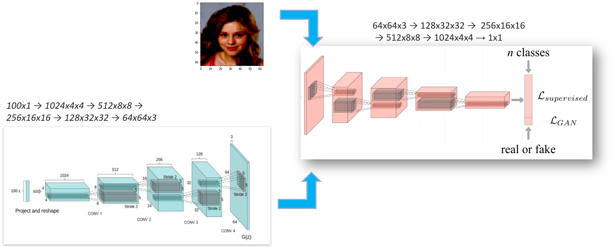
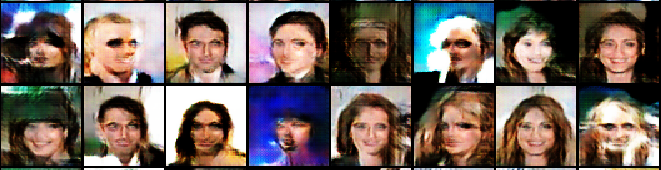
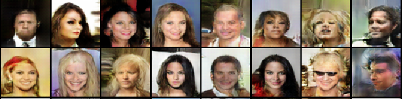
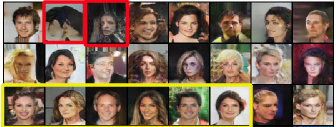
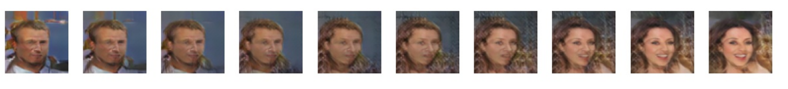
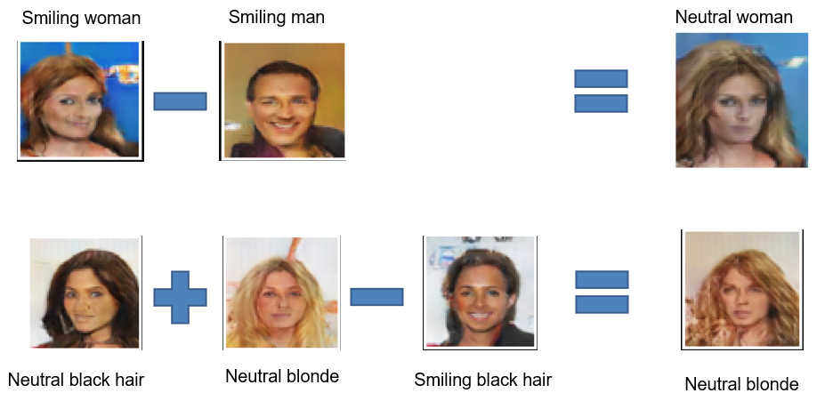

Pytorch Lightining implementation for VAE and DCGan.
Included examples with callbacks sampler

Dataset Used
1. CelebA

# Architecture
DC Gan

## Generated Image DCGan
1. Iteration 1

1. Iteration 5

1. Iteration 30

## Interpolation
1. GAN

## Vector math

